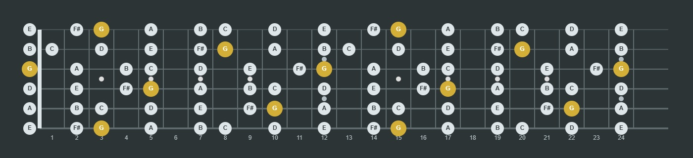
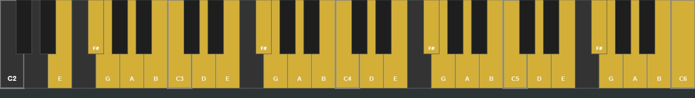
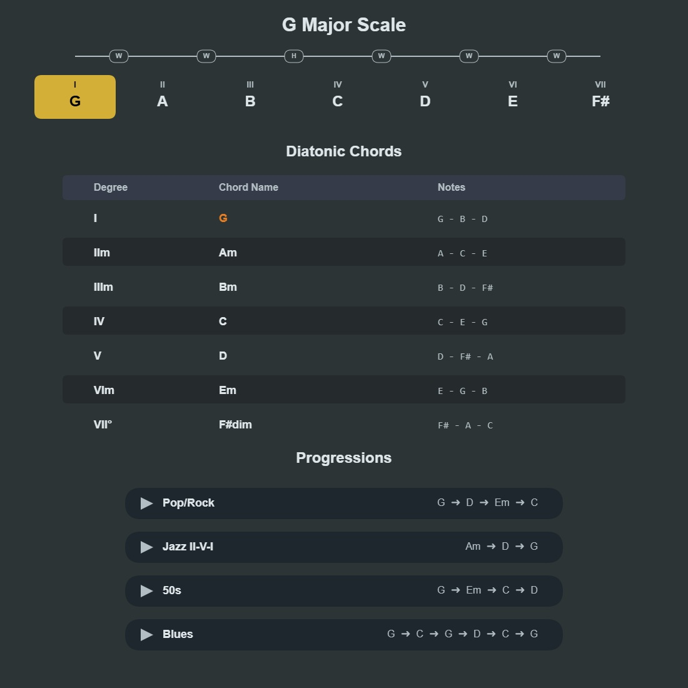
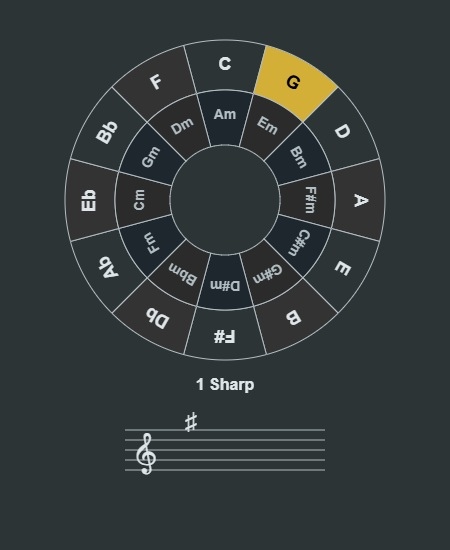
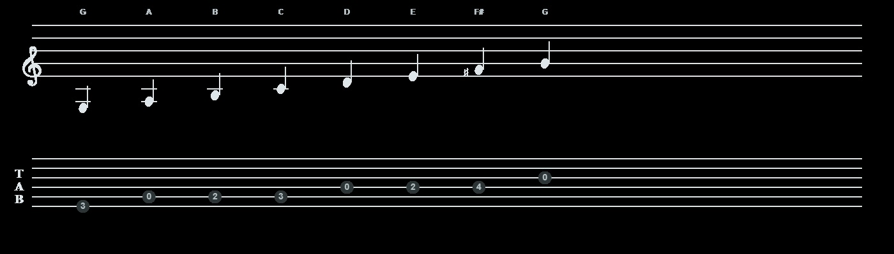

# **Tara \- GuitarLab 🎸🎹**

**Tara GuitarLab** is an advanced, interactive laboratory for visualizing music theory, scales, chords, and their relationships across multiple instruments (Guitar & Piano) right in your browser.  
[*برای مطالعه توضیحات فارسی به پایین صفحه مراجعه کنید 🇮🇷*](#توضیحات-فارسی)  
🔗 [**Live Demo / اجرای آنلاین**](https://soroush-zendedel.github.io/tara/)

## **✨ Features**

* **Interactive Fretboard:** Visualize any scale or chord across the entire guitar fretboard. Toggle between different CAGED positions and highlight octaves.  
* **Circle of Fifths:** An interactive circle to instantly select Major and relative Minor keys.  
* **Music Theory & Progressions:** Auto-generates scale degrees, diatonic chords, and common chord progressions (Pop, Jazz, Blues, etc.) for the selected key.  
* **Piano Reference:** Direct visual connection between the guitar fretboard and piano keys.  
* **Standard Notation & Tablature:** Automatically generates sheet music and guitar TABs for the selected scale or chord voicings.  
* **Built-in Audio Synthesizer:** Click on any note or chord on the fretboard, theory chart, or piano to hear its precise synthesized audio.  
* **Chromatic Tuner:** Built-in guitar tuner using your device's microphone (Web Audio API).  
* **Smart Metronome:** Adjustable BPM with visual and audio feedback.  
* **PDF Export:** Generate and download a comprehensive PDF booklet of your current scales and charts with a single click.  
* **Interactive Practice:** Calculate fretboard, scale, diatonic chord, ear-training, and microphone exercises; includes short lessons and locally saved progress.
* **Dark/Light Theme:** Fully responsive UI with seamless theme switching.

## **📸 Screenshots**

### **The Fretboard & Piano Connection**




### **Music Theory & Diatonic Chords**



### **Interactive Circle of Fifths**



### **Auto-Generated Notation & Tabs**



## **🚀 Quick Start (Local Setup)**

This project is completely built with **Vanilla HTML, CSS, and JavaScript**. No build tools or package managers are required\!

1. Clone the repository:  
   git clone https://github.com/soroush-zendedel/tara.git

2. Navigate to the project directory:  
   cd tara

3. Start a local static server from the repository root:
   ```bash
   python -m http.server 8000
   ```
4. Open `http://localhost:8000/` for the landing page or `http://localhost:8000/app.html` for the application.
   *The tuner requires HTTPS or localhost so the browser can request microphone access.*

The app is split into ordinary HTML, CSS, and ordered browser JavaScript files under `assets/`; it has no build step or package manager requirement.

## **🛠️ Tech Stack**

* **Core:** HTML5, CSS3, Vanilla JavaScript (ES6+)  
* **Graphics & Rendering:** HTML5 \<canvas\> API  
* **Audio & Tuning:** Web Audio API (AudioContext, AnalyserNode)  
* **Export:** [jsPDF](https://github.com/parallax/jsPDF)  
* **Landing Page UI:** Tailwind CSS

## **🤝 Contributing**

Contributions, issues, and feature requests are welcome\!  
Feel free to check the [issues page](https://github.com/soroush-zendedel/tara/issues).

1. Fork the Project  
2. Create your Feature Branch (git checkout \-b feature/AmazingFeature)  
3. Commit your Changes (git commit \-m 'Add some AmazingFeature')  
4. Push to the Branch (git push origin feature/AmazingFeature)  
5. Open a Pull Request

## **📄 License**

Distributed under the MIT License. See LICENSE for more information.

## **توضیحات فارسی**

**تارا گیتارلب (Tara GuitarLab)** یک آزمایشگاه تعاملی و پیشرفته برای تجسم تئوری موسیقی، گام‌ها، آکوردها و ارتباط آن‌ها روی سازهای مختلف (گیتار و پیانو) است که مستقیماً در مرورگر شما اجرا می‌شود.

### **🌟 امکانات کلیدی**

* **فرت‌بورد تعاملی (دسته گیتار):** نمایش کامل گام‌ها و آکوردها روی دسته گیتار با قابلیت فیلتر کردن پوزیشن‌ها (CAGED) و نمایش اکتاوها.  
* **دایره پنجم‌ها:** انتخاب سریع گام‌های ماژور و مینور نسبی و مشاهده سرکلیدها.  
* **تئوری و توالی آکوردها:** محاسبه خودکار درجات گام، آکوردهای دیاتونیک و توالی‌های معروف (پاپ، جز، بلوز و...).  
* **تطبیق با پیانو:** نمایش همزمان نت‌های انتخاب شده روی کلاویه‌های پیانو برای درک بهتر فواصل.  
* **نت‌نویسی و تبلچر (TAB):** رسم خودکار نت‌ها روی خطوط حامل استاندارد و تبلچر گیتار.  
* **پخش صوتی دقیق:** امکان کلیک روی هر نت یا آکورد در تمام بخش‌های برنامه برای شنیدن صدای آن (تولید شده توسط سینتی‌سایزر داخلی).  
* **تیونر کروماتیک:** کوک کردن گیتار از طریق میکروفون دستگاه با دقت بالا.  
* **مترونوم هوشمند:** دارای بازخورد دیداری و شنیداری با قابلیت تنظیم تمپو.  
* **خروجی PDF جزوه:** ذخیره تمام نمودارها و آموزش‌های روی صفحه در قالب یک فایل PDF با یک کلیک.  
* **تمرین تعاملی:** تمرین دسته، ساخت گام، آکوردهای دیاتونیک، تشخیص شنیداری، تمرین با میکروفون و درس‌های کوتاه همراه توضیح پاسخ و ذخیره‌ی محلی پیشرفت.
* **تم تاریک/روشن:** رابط کاربری مدرن و سازگار با انواع صفحات نمایش.

### **⚙️ نحوه اجرا (اجرای محلی)**

این پروژه کاملاً با جاوا اسکریپت خالص (Vanilla JS) و HTML/CSS نوشته شده است و نیازی به نصب هیچ پیش‌نیازی ندارد:  
۱. مخزن را کلون کنید:  
git clone https://github.com/soroush-zendedel/tara.git

۲. از ریشه پروژه یک سرور محلی اجرا کنید:
```bash
python -m http.server 8000
```
۳. صفحه فرود را در `http://localhost:8000/` یا برنامه را در `http://localhost:8000/app.html` باز کنید.
*(برای دسترسی تیونر به میکروفون، HTTPS یا localhost لازم است.)*
